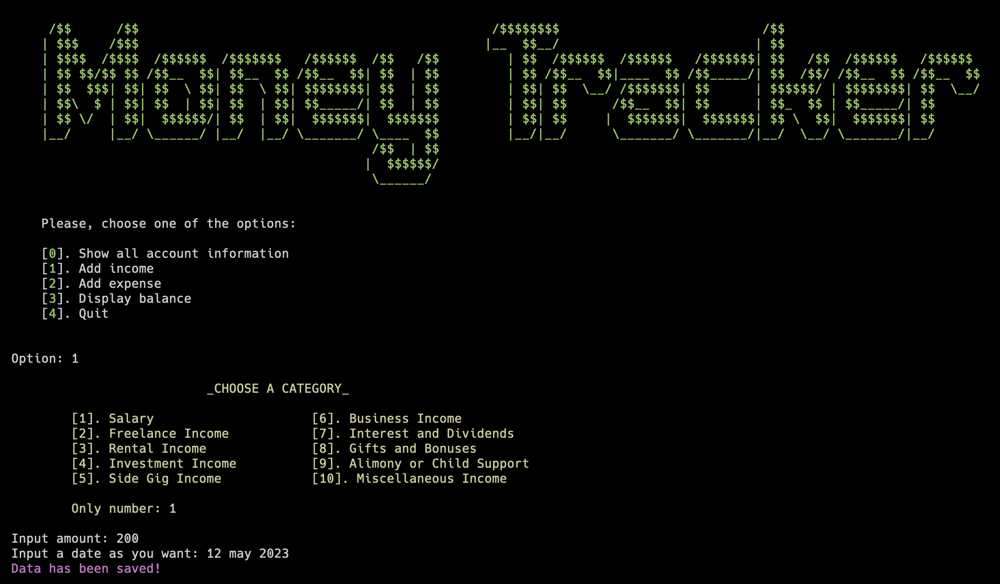

<h1>Finance Manager</h1>

This is a command line application to manage personal finances, built with Python.

<h2>Features</h2>
<ul>
    <li>Track income and expenses</li>
    <li>Categorize transactions</li>
    <li>Save transaction history to SQLite database</li>
    <li>View account balance</li>
    <li>Colored output using <code>Colorama</code></li>
</ul>

<h2>Usage</h2>
<ol>
    <li>Install requirements</li>
</ol>
<code>pip install -r requirements.txt</code>

<ol start="2">
     
    <li>Run <code>db.py</code> to initialize the database</li>
</ol>
<ol start="3">
    <li>Start the app:</li>
</ol>
<code>python main.py</code>

 
Choose an option:

<pre>
[0] Show account info
[1] Add income
[2] Add expense
[3] Display balance
[4] Quit
</pre>

<h2>Screenshots</h2>

<h2>Author</h2>

Nik1t7n

<h2>License</h2>

This project is licensed under the MIT License - see the <a href="LICENSE">LICENSE</a> file for details.

